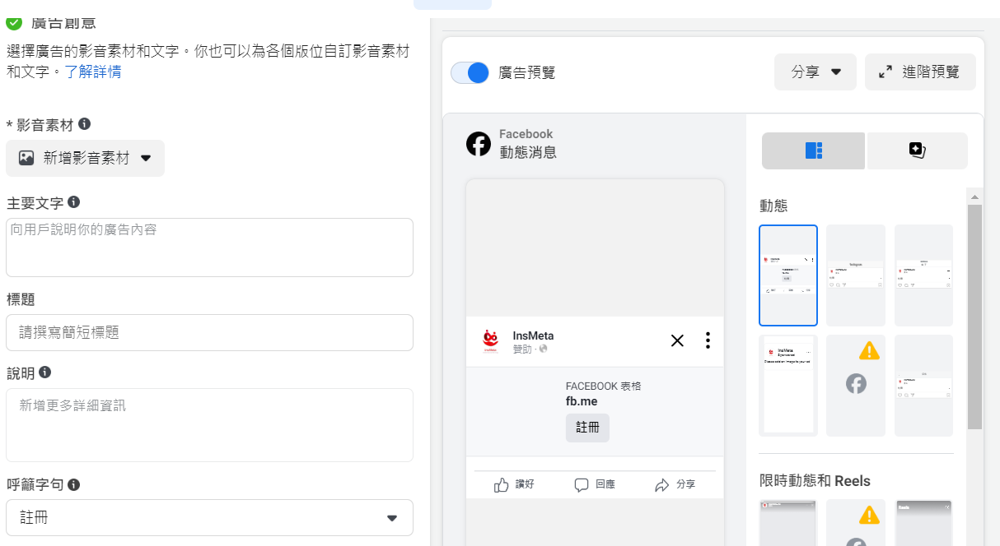

# Meta(Facebook and Ig) Ads Guide

## Importent Links:

[Mate site to vist Ads manager](https://adsmanager.facebook.com/adsmanager/manage/adsets/edit?act=472166211245415&nav_entry_point=bm_global_nav_shortcut&selected_adset_ids=23851500239560672&selected_ad_ids=23851500239700672&breakdown_regrouping=1)

_Importent:_ plz remember that all ads setting plz do it in this site

---

## View the ads History

---

## Step of post the ads on fb or ig

### Setp 1:

1. build
   
2. uesally is 互動 and 潛在
   
3. no setting here, you can name your ads name
   
4. next

### step 2:

1.  
    If u use leeds ads, u can use 即時表格
2.  
    better to set ur cost in your ads.(If u hv alot money u can no set it, and give me )
3.  
    set it
4.  Set ur target:
    ** think ur customer will do what or is what person **
    
    
5.  set ur ads where will display on
    
    
    \*\* Audience Network is 放大鏡位
6.  next

### step 3:

1. set ur ads 內容
2. set ur form
   
   
3. example:
   
   
   
   can add u wannna to know information:
   
4. 
   copy this link into here
   `
https://www.facebook.com/about/basics/privacy-principles`

5. 
   end of the form
